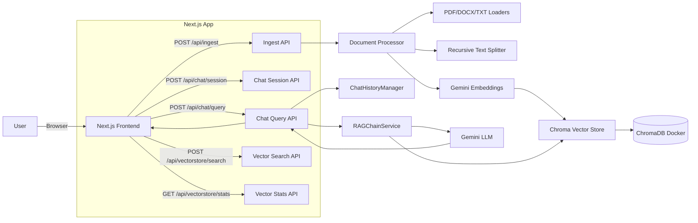
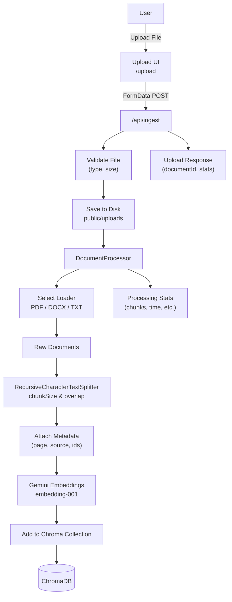
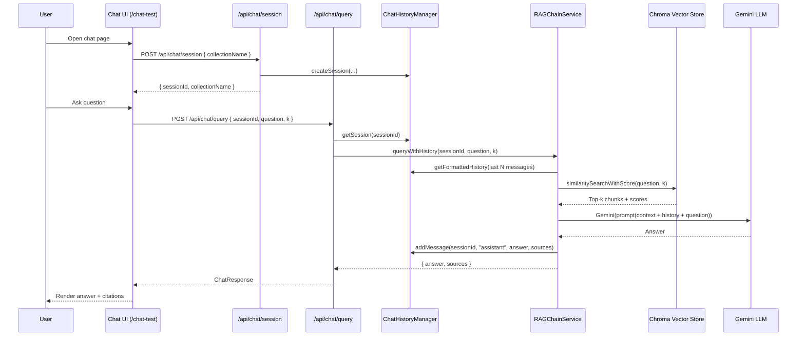

# RAG System – Chat with Your Documents

A production-ready Retrieval-Augmented Generation (RAG) system built with **Next.js (App Router)**, **LangChain.js**, **Google Gemini (LLM + embeddings)**, and **ChromaDB** as a vector database.

Users can upload documents (PDF, DOCX, TXT), automatically process them into semantic chunks, and then have natural, multi-turn conversations grounded in those documents.

---

## ✨ Features

- **Multi-format upload**  
  Upload PDF, DOCX, and TXT files via a drag-and-drop interface with validation (file type, size limit, etc.).

- **Automatic document processing pipeline**  
  Load → split into chunks → embed with Gemini → store in ChromaDB.

- **Conversational RAG**  
  History-aware chat that reformulates follow-up questions using previous turns and retrieves the most relevant chunks.

- **Source attribution**  
  Answers are returned with document source, page number, and other metadata so you can see exactly where the answer came from.

- **Session-based memory**  
  Each chat session has persistent history, enabling true multi-turn conversations per user/session.

- **Production-minded design**  
  TypeScript end-to-end, clear separation of concerns, Dockerized ChromaDB, and ready for deployment on platforms like Vercel.

---

## 🧠 Tech Stack

- **Frontend**
  - Next.js (App Router, 15+)
  - React + TypeScript
  - Tailwind CSS
  - shadcn/ui
  - `react-three-fiber` + `three.js` (3D landing visuals)

- **Backend**
  - Next.js API Routes

- **AI / RAG**
  - **LLM**: Google Gemini (e.g. 1.5 / 3 Flash)
  - **Embeddings**: `embedding-001` (3072 dimensions)
  - **Framework**: LangChain.js

- **Vector Store**
  - ChromaDB (Docker) with cosine similarity search

- **Other**
  - `pdf-parse` (PDF)
  - `mammoth` (DOCX)
  - `zod` for validation
  - `uuid` for IDs

---

## 🏗️ Architecture Overview

High-level view of how the pieces fit together:




## 📄 Document Processing Flow
From upload to vector store:



### Key ideas:

- Files are validated and stored under a UUID-based filename to avoid collisions.
- Documents are split into ~1200–1500 token chunks with ~20% overlap to preserve context across boundaries.
- Each chunk is embedded with Gemini embeddings and stored in ChromaDB with rich metadata (document ID, page number, chunk index, filename, etc.).

---

## 💬 Conversational RAG Flow
How a question becomes an answer:


The prompt instructs the LLM to answer only from the provided context and to explicitly say when the documents do not contain the requested information.

---

## 📁 Project Structure
```
├── README.md
├── components.json
├── eslint.config.mjs
├── next.config.ts
├── package.json
├── postcss.config.mjs
├── tsconfig.json
├── .prettierignore
├── .prettierrc
├── app/
│   ├── globals.css
│   ├── layout.tsx
│   ├── page.tsx                 # Landing page
│   ├── api/
│   │   ├── chat/
│   │   │   ├── query/route.ts   # Chat RAG endpoint
│   │   │   └── session/route.ts # Session management
│   │   ├── debug/chunks/route.ts# Chunking debug API
│   │   ├── ingest/route.ts      # Upload + process
│   │   ├── process/route.ts     # Manual/async processing
│   │   └── vectorstore/
│   │       ├── search/route.ts  # Raw vector search
│   │       └── stats/route.ts   # Collection stats
│   ├── chat-test/page.tsx       # Chat UI
│   ├── test-search/page.tsx     # Vector search tester
│   └── upload/page.tsx          # Upload UI
├── components/
│   ├── Sphere3D.tsx             # 3D Saturn scene
│   ├── landing/                 # Hero, features, process, CTA
│   ├── shared/                  # Navbar, Footer
│   ├── three/                   # 3D scene primitives
│   └── upload/file-uploader.tsx # Drag-and-drop uploader
├── hooks/
│   └── useMousePosition.ts
├── lib/
│   ├── utils.ts
│   ├── chains/
│   │   ├── prompts.ts           # RAG prompts
│   │   └── rag-chain.ts         # RAGChainService
│   ├── llm/
│   │   └── gemini.ts            # Gemini LLM integration
│   ├── loaders/                 # PDF, DOCX, TXT loaders
│   ├── memory/
│   │   └── chat-history.ts      # Session-based chat memory
│   ├── services/
│   │   └── document-processor.ts# Document processing pipeline
│   ├── splitters/
│   │   └── text-splitter.ts     # Recursive character splitter
│   ├── utils/
│   │   ├── file-storage.ts
│   │   ├── metadata.ts
│   │   └── validation.ts
│   └── vectorstore/
│       ├── chromadb.ts          # Chroma client/wrapper
│       └── embeddings.ts        # Gemini embedding helper
├── public/
│   └── uploads/                 # Uploaded files (local)
├── scripts/
│   └── check-chroma.js          # Chroma health check
└── types/
    ├── api.ts
    ├── chat.ts
    └── document.ts
```

---

### 🚀 Getting Started
#### 1) Prerequisites
- Node.js 18+ (20+ recommended)
- npm / pnpm / yarn
- Docker (for ChromaDB)
- A Google Gemini API key with access to:
    - An embeddings model (e.g. embedding-001)
    - A chat model (e.g. Gemini 1.5 / 3 Flash)

#### 2. Install dependencies
```
git clone https://github.com/mohtasheem135/Rag-System.git
cd Rag-System

# install dependencies
npm install
# or
yarn install
# or
pnpm install
```

#### 3. Configure environment
Create a .env.local in the project root and add:
```
# Required
GOOGLE_API_KEY=your_gemini_api_key_here

# Optional (example)
CHROMA_URL=http://localhost:8000
```

Then, ensure the LLM and embeddings code in lib/llm/gemini.ts and lib/vectorstore/embeddings.ts read from these environment variables, and that lib/vectorstore/chromadb.ts points at CHROMA_URL.

#### 4. Start ChromaDB
Run ChromaDB in Docker (basic example):
```
docker run -p 8000:8000 chromadb/chroma:latest
```
This will expose Chroma on http://localhost:8000.

#### 5. Run the Next.js dev server

```
npm run dev
# or
yarn dev
# or
pnpm dev
```

Then open:

- `http://localhost:3000` – Landing page
- `http://localhost:3000/upload` – Upload UI
- `http://localhost:3000/chat-test` – Chat interface
- `http://localhost:3000/test-search` – Vector search tester (if implemented in the UI)

---

### 🧪 How to Use

#### A. Upload documents
1. Go to /upload.
2. Drag and drop a PDF/DOCX/TXT file, or click to browse.
3. Submit the upload.
4. The backend:
    * Loader (PDF/DOCX/TXT)
    * Recursive text splitter (1200–1500 tokens, ~20% overlap)
    * Metadata enrichment
    * Gemini embeddings
    * Store vectors in ChromaDB
5. The response includes:
    * documentId
    * Number of chunks created
    * Number of vectors stored
    * Processing stats (time, average chunk size, etc.)

#### B. Chat with your documents
1. Go to /chat-test.
2. The client first creates a session via /api/chat/session.
3. Ask a question about your uploaded documents.
4. Each question is sent to /api/chat/query with:
    * sessionId
    * question
    * optional collectionName
    * optional k (top-k chunks)
5. The backend:
    * Appends the question to chat history.
    * Retrieves the most relevant chunks from Chroma.
    * Builds a prompt with:
      * Context (chunks + metadata)
      * Chat history
      * Current question
    * Calls Gemini LLM to generate an answer.
    * Returns the answer plus normalized source metadata.
6. The UI renders the answer with citations and source info.

#### C. Test vector similarity search
* Use /test-search (if wired) to:
  * Enter an arbitrary query.
  * Hit the search endpoint (/api/vectorstore/search).
  * Inspect which chunks are retrieved and their similarity scores.

#### D. Debug & inspect chunks
* Use /api/debug/chunks with query params like:
  * filename
  * fileType
* This endpoint runs the processing pipeline for that file and returns:
  * High-level stats
  * A small sample of chunks (truncated), for inspection and debugging.

---

### 🔧 Configuration & Customization

- Chunk size & overlap
  - Adjust in the text splitter configuration (e.g. lib/splitters/text-splitter.ts) to trade off between recall, latency, and token usage.
- Embeddings model
  - Swap out Gemini embeddings or tune batch size / rate limiting in lib/vectorstore/embeddings.ts.
- LLM model & temperature
  - Modify the Gemini model, temperature, and other generation parameters in lib/llm/gemini.ts.
- Prompting
  - Tweak system and user prompts in lib/chains/prompts.ts to modify answer style, strictness about context, etc.
- Collections & multi-tenancy
  - Use different Chroma collections per user, per dataset, or per environment by threading collectionName through the APIs.

---

### 🧭 Roadmap Ideas
Potential extensions you can build on top of this:
- Streaming responses in the chat UI using a streaming endpoint for Gemini.
- User authentication and per-user collections / ACLs.
- Hybrid search (semantic + keyword / filters) and reranking for more accurate retrieval.
- Analytics dashboard for processing stats and query patterns.
- Cloud deployment:
  - Frontend + API on Vercel
  - ChromaDB on a managed service or self-hosted VM

